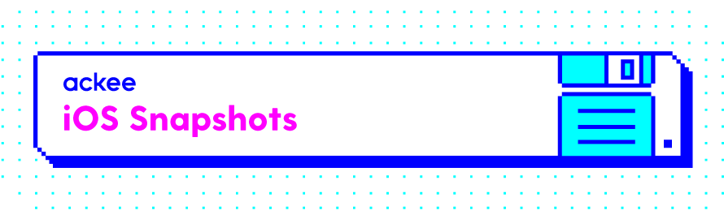

# Ackee Snapshots

Set of extensions that we use to simplify out snapshot tests using [SnapshotTesting][snapshot-testing]

## Installation

As [SnapshotTesting][snapshot-testing] is only available through SPM, this is the only installation option for AckeeSnapshots too.

Just add it to your _Package.swift_ or your Xcode project.


## Usage

In your shared testing framework (we recommend using it and including it to all your test targets) define shared instance of [SnapshotTest](Sources/AckeeSnapshots/SnapshotTest.swift) object:
```swift
public let assertSnapshot = SnapshotTest(
  devices: [
    .iPhone8,
    .iPhone13ProMax,
    .iPadPro11,
    .iPadPro12_9
  ],
  record: false,
  displayScale: 1,
  contentSizes: [.extraExtraExtraLarge, .large, .small],
  colorSchemes: [.light, .dark]
)
```
And in your test use assert method of your choice:
```swift
import AppTesting
import XCTest

func test_appearance() {
  assertSnapshot.devices(SubjectView())
}
```

## Recommendations

As we use snapshot tests for quite a long time, we have developed several practices that we consider good:

### Use [Git LFS](https://git-lfs.com) for storing snapshots
At the beginning you will have a few snapshots so it will not matter, but think about the future. 
If you really snapshot a lot, you might end up with hundreds of megabytes of images, that means that all developers
will have all snapshots stored locally at any time (unless you use a shallow clone, which is not very practical for development).

When using LFS all files are just pointers to the actual files and you can have only snapshots that are relevant for your current commit.

### Think of what devices are relevant for you

Trying to cover all devices/font sizes that your app supports is probably a bad idea. The tests will take forever and will use a lot of space, 
that increases pull/clone time and makes development a bit more complicated.

We usually use one iPhone with home button, one iPhone with home indicator and the same with iPads. 
For dynamic type we stick with `large` that is default and one smaller and one larger size.
Color schemes are only to so we snapshot both of them it app supports dark mode.

This creates a reasonable set of snapshots that truly help us in development.

### Use lower display scale

Having real life snapshots is nice, but once you start snapshotting a 13-inch iPad, a single snapshot can easily have over 10 MB.
This way your repository or LFS storage will grow rapidly, we generally recommend using `displayScale: 1` for snapshots as they are pretty decent
to discover major problems in the app and use really low amount of disk space.

[snapshot-testing]: https://github.com/pointfreeco/swift-snapshot-testing/tree/main
